# Resumo de Sistemas Operativos
## Diogo Chança

---

### Índice

- SO

- IO

- Ficheiro

- Computador

- Linux

---

#### SO

Conjunto de programas e dados associados, no qual permite gerir e utilizar recursos
disponíveis de um equipamento informático como um computador ou um smartphone. Alguns exemplos de Sistemas Operativos são: Windows, Mac OS e Solaris para computador e Android e iOS para smartphone.

Exemplo1: Windows 10

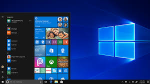

Exemplo2: Mac OS

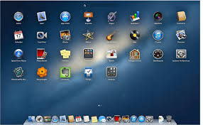

---

##### Tipos de SO

- Monotarefa: sistema onde só é possível a realização de uma única tarefa de cada vez. Desta forma, uma tarefa é executada pelo processador desde o início até ao fim. Trata-se de uma técnica de gestão de tarefas ineficiente e limitada. Exemplo: o MS-DOS. Também um SO monotarefa ***não é preemptivo***, ou seja, não pode interromper a tarefa realizada.

- Multitarefa: sistema que tem a capacidade de executar vários processos em simultâneo. Trata-se de uma técnica de gestão de tarefas eficiente e moderna, conducente a uma boa otimização e desempenho geral do sistema. Exemplos: Solaris,bMicrosoft Windows, Unix/Linux e derivadose Apple/Macintosh. Também um SO multitarefa é ***preemptivo***, ou seja, pode interromper a tarefa realizada através de dar um tempo a outra tarefa para ser realizada, interrompendo a tarefa anterior.

---

##### Sistemas não Preemptivos e Preemptivos

Capacidade de um sistema, através do Kernel ou Processador poder interromper temporariamente uma tarefa que esteja a ser executada. A esta troca de processos dá-se o nome de Context Switch ou Troca de Contexto. Os Sistemas Preemptivos têm como objetivos:

-Executar comandos e programas do utilizador e do Sistema de uma forma
justa e eficiente, dando uma boa oportunidade a todos os processos,
respeitando prioridades;

-Facilitar o acesso e uso da máquina;

-Fornecer uma interface entre o Hardware e o utilizador;

-Utilizar o Hardware de forma eficiente: discos, placas, memórias,
ficheiros, etc.

-Gerir os recursos: Processos, ficheiros, memórias e entrada e saída de
dados(I/O)

---

##### Processos

Instância de um programa em execução. Funciona como um contentor ou ambiente onde existe um conjunto de recursos que são usados por parte do programa a ser executado dentro do ambiente. Este conjunto de recursos inclui tempo de CPU, memória, ficheiros e dispositivos de E/S, entre outros. Realce-se que o mesmo programa pode estar a ser executado por diferentes processos, por exemplo, múltiplos utilizadores.

Um processo tem a seguinte constituição:
• Código executável
• Dados
• Pilha de execução (Stack)
• Heap ou GAP (espaço livre para ser usado sempre que necessário)
• Valor do Contador de programa (PC – Program Counter)

Identificação de um Processo
Um processo pode ser identificado por diversos parâmetros, entre eles os
seguintes:
• Identificador:
Um identificador único associado ao processo.

• Estado:
O estado atual do processo.

• Prioridade:
Nível de prioridade relativamente a outros processos

• Programa Counter
O endereço da próxima instrução a ser executada no programa

• Ponteiros para Memória
Ponteiros para o código do programa e dados associados ao programa

• Dados de Contexto
Dados presentes nos registos do CPU enquanto o processo está a ser
executado.

Criação e Execução dos Processos
Um processo é criado pelo núcleo do Sistema Operativo, o Kernel, mais
precisamente pelo Scheduler ou Escalonador de Processos, que é uma das
funcionalidades do Kernel.
Os processos são executados em pseudo-paralelismo.
Pseudo-paralelismo porque o Sistema Operativo dá a ilusão ao utilizador de que
cada processo é executado isoladamente num CPU de uma forma contínua,
quando, na realidade, a cada processo é atribuída uma determinada fatia de
tempo (quantum ou time slice) de execução de cada vez.
Quando a fatia de tempo de um dado processo expira, o kernel muda o
processamento para um outro processo com outra fatia de tempo, num
mecanismo conhecido por comutação de processos, com base nas prioridades
dos processos, interrupções, e de algoritmos de escalonamento a analisar
brevemente.
A imagem abaixo ilustra o conceito de pseudo-paralelismo. O computador é
partilhado por 4 processos, nomeadamente processos A, B, C, e D. O processo A
é executado durante um time slice e logo que este intervalo de tempo expire é
comutado, dando assim a vez ao processo B. Este mecanismo continua para os
processos C e D, repetindo-se novamente todo o processo com a chamada de
volta do processo A para mais um intervalo de tempo de execução e assim
sucessivamente. Com o passar do tempo e a execução completa de todos os
quatro processos, deu-se a ilusão de que os processos foram executados em
paralelo.

Para um SO é normal ter em execução centenas ou milhares de processos.
Um processo pode criar um ou mais subprocessos, para incumbências
específicas, tal como estes também podem criar os seu próprios subprocessos, 
formando-se uma cadeia hierárquica de processos, numa relação de processos
pais-filhos.

Estados dos Processos
Durante o seu percurso de execução, um processo percorre vários estados:

1. Novo (New)
O processo está a ser criado, mas ainda não foi admitido no espaço dos
processos prontos para execução. Isto significa que já foi criada uma
estrutura (Process Control Block) para este processo, mas que ainda não
foi carregado para a memória.

2. Pronto (Ready)
O processo está pronto a ser executado, aguardando atribuição de tempo
de processamento de CPU.

3. Em Execução (Run)
As instruções do processo estão a ser executadas.

4. Espera/Bloqueado (Waiting/Blocked)
O processo espera por eventos ou recursos, ficando assim bloqueado.
Por exemplo, à espera da execução de uma tarefa que requereu um
acesso I/O, tendo sido criado um processo filho para essa execução, pelo
que está agora a aguardar por essa resposta (do processo filho).

5. Suspenso (Suspended)
Time slice expirou. O processo foi retirado do processador pelo
Scheduler.

6. Concluído (Terminated)
O processo terminou e os seus recursos foram libertados

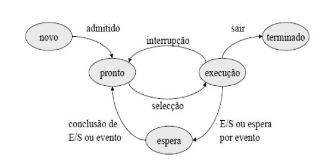

---

###### Critérios de Processos
Há vários critérios para a análise de algoritmos de escalonamento:

• Utilização da CPU:
Deve-se maximizar a utilização da CPU. Deve variar entre 40% e 90% em
sistemas de tempo real. Um critério de maximização.

• Débito (throughput):
Deve-se maximizar o número de processos concluídos por unidade de
tempo. Outro critério de maximização.

• Tempo de circulação (turnaround):
Tempo que decorre entre o instante em que um processo é submetido e
o instante em que é concluído. Critério de minimização.

• Tempo de espera:
O tempo de espera é a soma dos períodos dispendidos na ready queue.
Critério de minimização.

• Tempo de resposta: 
Pretende-se minimizar o tempo que decorre entre a submissão dum
pedido e o início da resposta.
Este critério é adequado para sistemas interativos. Critério de
minimização.

Processo Table
Todos os processos encontram-se registados numa tabela que contém toda a
informação acerca do estado de cada processo, como por exemplo:
a) Identificação do processo e do utilizador
b) Prioridade
c) Estado do processo
d) Periféricos utilizados
e) Ficheiros abertos.
f) Programas em execução
g) Diretoria (pasta onde estava)
h) Quotas de utilização de recursos
I) Contabilização da utilização de recursos.

Processos no Arranque no Sistema Linux
A figura abaixo, do livro do autor Andrew S. Tanenbaum – Operating Systems.
4th.Edition, ilustra os processos envolvidos no Arranque de um Sistema Linux
tipo.
Processos:
Processo 0 (Booting)
Processo init (lança a Shell)
Processo getty (lança os processos dos terminais)

---

##### Funções de um Sistema Operativo
1. Entrada/Saída de Dados (E/S) – Input/Output (I/O)
• Ler ou escrever dados em sistemas de armazenamento externo
(Discos Rígidos, CDs, etc.).
• Impressão de dados.
• Comunicação com os Periféricos e a CPU (Central Processing Unit).

2. Interpretação de Comandos (Shell)
• Ler os comandos digitados pelos utilizadores, interpretá-los e
executá-los apropriadamente.
• Saliente-se que a Shell é um interface que pode tomar a forma de
linha de comando ou gráfica (GUI – Graphics User Interface).

3. Gestão de Ficheiros
• Criação e Manipulação de Ficheiros
• Armazenamento dos ficheiros em estruturas lógicas e físicas, de
rápido acesso.
• Controlo do uso da memória secundária.
4. Segurança
• Proteção dos ficheiros, definindo modos de acesso.
• Proteção dos utilizadores.
• Proteção do próprio sistema (todas as suas estruturas).

5. Multitarefa – Controlo do uso do Processador – Tempo Compartilhado
• Vários utilizadores acedendo ao computador ao mesmo tempo.
• Vários utilizadores executando programas (processos) em tempo
partilhado de processamento.
• Controlo do uso do processador.

6. Gestão de Memória Física – Virtual
• Gestão da Memória Física (RAM) e Virtual (área de SWAP no Disco).
• Criação e gestão de Páginas Virtuais (pages) e Páginas Físicas
(frames).
• Permutação de Processos entre as Memórias Física e Virtual.

7. Comunicação
• Comunicação com outros computadores, internamente ou por
meios de telecomunicações.
Contabilidade
• O registo dos recursos usados.

8. Desenvolvimento de Software
• Ferramentas para escrever, manter e executar programas (por
exemplo, compiladores, bibliotecas, etc.).

9. Módulos de um Sistema Operativo
Pela apresentação das funcionalidades acima, podemos considerar que
um Sistema Operativo é constituído pelos seguintes módulos:
• Gestão de Processos
• Gestão da Memória Principal
• Gestão de Ficheiros
• Gestão de Input/output (I/O)
• Gestão da Memória Secundária
• Gestão de Rede
• Proteção e Segurança do Sistema
• Interpretação de Comandos (Shell Linha de Comandos/Gráfica)

---

##### Componenstes de 1 SO:

1. O Kernel (núcleo), em conjunto com os drivers e o firmware do dispositivo,
fornecem o nível mais básico de controle sobre todos os dispositivos de
hardware do computador (CPU, Memória e Devices). Este gere os acessos à 
memória RAM e determina quais os programas com maior prioridade e quais
os recursos do hardware a que as aplicações acedem.
Estabelece assim uma ligação entre as Aplicações e o Hardware.

2. A Rede é fundamental na maioria dos Sistemas Operativos pois permite-nos a
ligação com outras máquina, incluindo máquinas que estão na Internet.
Assim, computadores com Sistemas Operativos diferentes, podem participar na
mesma rede e partilhar recursos entre eles, como impressoras, scanners, etc.

3. A segurança é outra das caracteristicas fundamentais num sistema operativo
pois deverá ter mecanismos para proteger a informação, para que os processos
acedem as zonas de memória permitidas, etc

4. A interface com o utilizador pode ser gráfica (GUI) ou linha de comandos
(terminal). Atualmente, quase todos os Sistemas Operativos contam com uma
interface gráfica, mas ainda é possível encontrar o terminal em muitos locais.
Depois do arranque do computador pela BIOS), parte do sistema sistema
operativo é carregado para a memória RAM.
Os programas de computador, funcionam dentro do Sistema Operativo e
passam a chamar-se processos quando executados

--- 

##### Software Livre
O código-fonte do Kernel Linux está disponível livremente sob a licença GPL
(GNU General Public License – Licença Pública Geral) que permite que
qualquer pessoa possa utilizar, modificar e distribuir livremente, desde que
não altere os termos da licença.

---

##### Partição do Disco Rígido
A partição de um disco rígido é uma divisão dentro de uma unidade de
armazenamento física com seu próprio Sistema de Ficheiros. 
Ainda que se tenha apenas um disco rígido físico conectado, o sistema tratará
cada partição como se fosse um disco rígido independente.
Teremos assim um disco rígido físico e vários virtuais
Sistemas de Ficheiros
Cria-se a partição de disco rígido quando se atribui a uma divisão do disco de
seu próprio sistema de ficheiros, dos que há vários tipos: FAT, NTFS, FAT32,
EXT2, etc.
Partições primárias, estendidas e lógicas
Além dos tipos de sistemas de ficheiros, há também três tipos de partições
(independentes do sistema de ficheiros que se utilize). Estas podem ser
partições primárias (as originais, um disco rígido formatado é uma partição
primária que ocupa todo o espaço), partições estendidas ou secundárias
(uma partição que pode conter outras partições em seu interior), e partições
lógicas (as partições que ocupam uma parte ou a totalidade de uma
estendida).

---

##### Área de SWAP
É uma área do Disco rígido que serve de troca de processos ou tarefas.
Trata-se de uma memória virtual que funciona como uma extensão da
memória RAM.
A razão da existência da memória swap reside no fato do sistema operativo
precisar de memória para funcionar, e se a memória acabar, o sistema falha.
O swap fica como uma reserva de emergência caso a memória RAM acabe.
É sempre recomendado utilizar swap, mesmo com muita memória RAM.
Dado que o swap é mais lento que a memória RAM, se colocar swap demais
num sistema e começar a usá-lo muito vai ganhar uma grande lentidão!
(muita lentidão em discos convencionais e mesmo assim lentidão em discos
SSD).

---

#### IO

1. Gestão I/O
Uma das principais funções de um sistema operativo é controlo dos dispositivos
I/O (em inglês: I/O=Input/Output ou em português: E/S = Entrada/Saída).
Funções:
• Enviar comandos para o dispositivos
• Detetar interrupções
• Gestão de erros
• Interface entre o utilizador e o resto do sistema
2. Categorias de I/O
a) Block device
A informação (data) é armazenada em blocos de tamanho fixo.
 Cada bloco contém um endereço.
Os blocos vão normalmente de 128 a 1024 bytes, qualquer um pode ser
lido independentemente em relação a qualquer outro.
Exemplos:
Discos
CDs
Pen
Fitas (bobinas)
b) Character

Transmite ou aceita streams (a palavra streams significa ou traduz-se por
riachos ou braços de um rio com um bom caudal e veloz).
A palavra streams, no contexto do Sistema I/O,significa fluxo de carateres
(que é como um riacho de carateres).
Exemplos:
Terminais
Impressoras
Teclados
Ecrãs

3. Device Controller (driver)
• É um adaptador
• É uma componente eletrónica + software
• É uma unidade I/O
Sob a forma de:
Componente mecânica
 Componente eletrónica
 Componente SW
Os Controladores podem controlar 2, 4, 8 ou mais devices idênticos.
O sistema operativo normalmente lida com o controller e não com o device.
Funcionalidades:
• Temporização e Controlo das transmissões e interrupções
• Comunicação com a CPU
• Comunicação com o dispositivo (periférico)
• Transferência dos dados
• Deteção de erros

4. Disk Controller
• Converte principalmente bits do disco, numa sequencia serial, em
blocos e testa para erros (p.e. CRC).
• Se não houver erros então os blocos são copiados para a memória.
• Os controladores têm registos (buffers).
O sistema operativo efetua operações I/O de comando através de
comandos para os registos de controlo dos devices.
Exemplo:
 Caso do disco:
Read
 Write
 Seek
 Format
 Etc.
Muitos destes comandos têm parâmetros
A CPU lê os registos de Controle para obter informações.

5. DMA - Direct Memory Access
Nos sistemas I/O e nos processos de transferências de data é muito usada a
técnica de DMA (Direct Memory Access).
DMA é assim uma via direta entre um dispositivo I/O e a Memória.
Em DMA o CPU dá ao controlador duas coisas:
a) Local da memória para onde transferir os dados.
b) O número de bytes a transferir
O controlador transfere diretamente e só no fim causa um interrupt.

6. Interrupt Handlers/Vectors e Interrupt Service Routines (ISRs)
Handlers/Vectors (simulação de um exemplo tipo):

|Cod erro|Memória|Erro|
|:-:|:-:|:-:|
|000000|300000|Power Failure|
|000004|400000|Reset|
|000008|500000|Address Error|
|000012|600000|Bus Error|
|000016|700000|Illegal Address|
|000020|800000|Divide By Zero|
|000024|...|...|

Interrupt Service Routines (ISRs)
Tratamento dos Interrupts (simulação exemplo tipo):

300000 Sub Power_Failure
Código para tratamento da Falha da Fonte de
Alimentação:
• Salvaguarda de toda a informação a ser usada no
recursos, tais como: registos, ficheiros, estados dos
processos, etc.)
• Recuo dos braços dos discos
• Etc.
IRET
End Sub

7. Organização do Sistema I/O
O Sistema I/O é estruturado em quatro camadas:
a) Interrupt Handlers
b) Device Drivers
c) Device – independente
d) User level Software

---

#### Ficheiro

Ficheiro
É uma coleção de informação relacionada, identificada por um nome.
Propriedades dos Ficheiros:
• Nome
• Tipo
• Local
• Tamanho
• Datas (criação, última edição, etc.)
• Dono
• Segurança (dono, grupo e outros ou mundo)
Operações sobre os Ficheiros
• Criação
• Escrita
• Leitura
• Eliminação
• Cópias
• Deslocação
Sistema de Ficheiros
É uma estrutura de diretórios (pastas), bem organizada, que permite armazenar, criar e
eliminar ficheiros em diferentes formatos.
É constituído principalmente por duas partes bem visíveis:
1) Ficheiros (Dados)
2) Estrutura de Diretórios
É responsável pelas seguintes funcionalidades:
• Criação e eliminação de ficheiros
• Criação e eliminação de diretórios
• Suporte das funções base para manipulação de ficheiros e diretórios
• Mapeamento dos ficheiros (estrutura lógica) no suporte de armazenamento
secundário (estrutura física)
• Criação de cópias de Segurança dos ficheiros em suporte estável, não volátil
• Gestão e manutenção das permissões de acesso aos ficheiros.
Estrutura de Diretórios
É uma estrutura que permite gerir e organizar o conjunto de ficheiros existentes num
volume (disco).
Operações desempenhadas num Diretório:
• Pesquisa de Ficheiros
• Criação de Ficheiros
• Eliminação de Ficheiros
• Listagens de conteúdos
• Deslocação de ficheiros
Organização dos Diretórios
A organização mais comum e popular é em árvore com um número arbitrário de níveis.

---

#### Computador
É uma máquina que tem a capacidade de manipular a informação através
das suas unidades de processamento, memória e periféricos de entrada
(input) e saída (output) de dados.
As capacidades de um computador são imensas, incluindo principalmente
armazenamento de dados, processamento de dados, cálculo em grande
escala, desenho industrial e artístico, tratamento de imagens gráficas,
realidade virtual, entretenimento e cultura.
Um computador inclui também as capacidades de Aprendizagem
Automática e de Processamento de Linguagem Natural (PLN), áreas que
dizem respeito á Inteligência Artificial.
Principais características de um Computador
• Automático – manipula informação sem necessitar de intervenção
humana.
5
• Universal - manipula informação que representa áreas diferentes.
• Eletrónico – usa componentes eletrónicas para manipular a
informação.
• Digital – representa a informação através de dígitos binários.

---

##### Elementos Fundamentais de uma Arquitetura
Convencional de Computadores
Um computador moderno é constituído por um ou mais processadores com
um ou mais CPU Cores, Memória Principal (RAM, ROM, Caches, etc.),
Memoria Secundária (Discos) e Dispositivos de Entrada e Saída, usando alta
tecnologia, em constante evolução, formando um sistema complexo de
interligações, funcionalidades e comunicações, com grande capacidade de
armazenamento e processamento de informação, em alta velocidade.

- Tipos de Componentes de um Computador
Um computador consiste por um conjunto de três tipos de componentes:
• Processador
• Memória
• I/O (Input/Output)

- Categorias de Estruturas de Interconexão (BUS) de um Computador
Os componentes de um computador estão interligados entre si através de
vias de interligação ou de interconexão, denominadas de barramentos ou
BUS (inglês) e agrupadas em três categorias:
1. Sinais de Controlo
2. Endereços
3. Dados
As quais comunicam entre si, sob controlo de sinais (Read, Write, etc.)

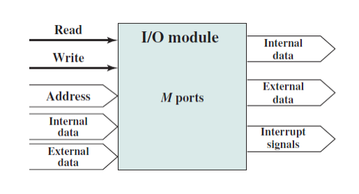

---

##### Arquitetura de um computador

---

---

1. Motherboard - Placa-mãe
A Motherboard de um computador é a placa existente no seu interior que
contém um conjunto de circuitos eletrónicos, responsáveis pelo
processamento de dados e pelas trocas de informação no interior do
computador. sendo as placas a ela ligadas as placas
filhas. Os condutores impressos, ou linhas, que formam os denominados
barramentos, constituem circuitos elétricos, que transportam dados,
endereços (localizações físicas de componentes e posições de memória) e
sinais de controlo por todo o computador. 
Contém como componentes principais o microprocessador e as memórias
RAM e ROM, para além de vários circuitos integrados e slots de expansão,
interligados entre si, através das vias de interconexão.
As duas figuras abaixo são ilustrativas.
A primeira figura representa um diagrama da motherboard com os slots de
expansão.
Diagrama da motherboard com os slots de expansão
A segunda figura representa uma motherboard clássica tipo (independente
do fabricante, modelo e do ano de fabrico)

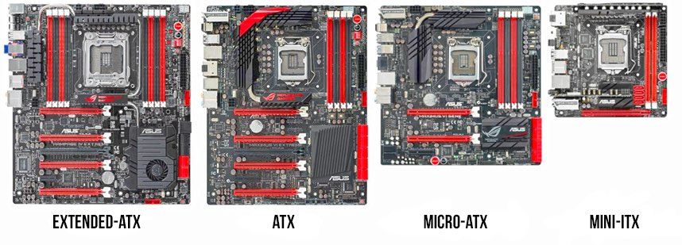

---

2. CPU – Unidade Central de Processamento
É constituída minimamente pelos seguintes componentes:
Unidade de Controlo (UC):
• Controla a execução das instruções do programa
• Interpreta as diferentes instruções e ativa os subcomandos
que as executam.
• Controla as transferências de dados (memória
central/memória auxiliar e memória central/unidade
aritmética e lógica).
Unidade Aritmética e Lógica (ALU – Arithmetic Logic Unit):
• Executa as operações aritméticas e lógicas
Registos:
• Um registo é uma pequena área de memória, onde cabem 8 a
64 bits, utilizada em todas as operações efetuadas no interior
do microprocessador (CPU)
Outra Funcionalidade relevante da CPU:
Tratamento de Interrupções – CPU e Interrupt Controller
Uma das atividades principais da CPU, juntamente com o Controlador de
Interrupções, é o Controlo e Tratamento de Interrupções, a ser analisada
brevemente.

---

3. Chipset: componente que se divide em 2 partes: a Ponte norte (north bridge) que comunica com o processador e controla a memória e a Ponte sul (south bridge) que comunica com os periféricos, entradas (por exemplo SATA) e as portas (exemplos: USB e HDMI).

---

4. Memórias
São todos os dispositivos que permitem a um computador guardar dados,
temporária ou permanentemente.

- ROM
Memória permanente do computador onde estão inscritas as rotinas
básicas de software necessárias ao arranque do computador e ao teste dos
vários dispositivos do hardware. Um dos componentes mais importantes da
ROM é a BIOS, conjunto de programas que viabilizam a ligação do software
com o hardware.

- RAM
Memória de trabalho onde são armazenados os programas e os dados que
intervêm no processamento do computador. A sua capacidade de
armazenamento determina a extensão dos dados e programas que podem
residir na memória durante a execução dos programas.

- CACHE
É uma memória muito rápida que desempenha o papel de intermediária
entre a memória RAM e o processador. Nesta memória, são armazenadas 
as instruções utilizadas com mais frequência. Pode aumentar
significativamente o desempenho global do sistema.

# RAM:
Tipos:
• SRAM - Static RAM – CACHE
Pequena, cara, rápida e de fabrico à base de transístores.
Aplica técnicas que tornam os acessos aos dados de uma forma
mais rápida, aumentando assim o desempenho do
computador.

## Informação para Leitura-Consulta-CACHE:
“
Na área da computação, a cache é um dispositivo de acesso
rápido, interno a um sistema, que serve de intermediário entre
um operador de um processo e o dispositivo de
armazenamento ao qual esse operador acede. A vantagem
principal na utilização de uma cache consiste em evitar o
acesso ao dispositivo de armazenamento - que pode ser
demorado - armazenando os dados em meios de acesso mais
rápidos.
O uso de memórias cache visa obter uma velocidade de acesso
a memória próxima da velocidade de memórias mais rápidas,
e ao mesmo tempo disponibilizar no sistema uma memória de
grande capacidade, a um custo similar de memórias de
semicondutores mais baratas.
Com os avanços tecnológicos, vários tipos de cache foram
desenvolvidos. Atualmente há cache em processadores, discos
rígidos, sistemas, servidores, nas placas-mãe, clusters de bases
de dados, entre outros. Qualquer dispositivo que requeira do
utilizador uma solicitação/requisição a algum outro recurso,
seja de rede ou local, interno ou externo a essa rede, pode
requerer ou possuir de fábrica o recurso de cache.
Por ser mais caro, o recurso mais rápido não pode ser usado
para armazenar todas as informações. Sendo assim, usa-se o
cache para armazenar apenas as informações mais 
frequentemente usadas. Nas unidades de disco também
conhecidas como disco rígido ou Hard Drive (HD), também
existem chips de cache nas placas eletrónicas que os
acompanham. Como exemplo, a unidade Samsung de 160 GB
tem 8 MBytes de cache.
No caso da informática, o cache é útil em vários contextos:
• Nos casos dos processadores, em que cache disponibiliza
alguns dados já requisitados e outros a processar;
• No caso dos navegadores, em que as páginas são guardadas
localmente para evitar consultas constantes à rede
(especialmente úteis quando se navega por páginas
estáticas);
• No caso das redes de computadores, o acesso externo, ou à
Internet, se dá por meio de um software que compartilha a
conexão ou link, software este também chamado de proxy,
que tem por função rotear as requisições a IPs externos à
rede que se encontra, nestes proxys temos ainda um cache,
que na verdade é uma enorme lista de todos os sites que
foram visitados pelos usuários dos computadores desta
rede, fazendo com isto a mesma função que os caches
presentes nos navegadores, ou browsers, só que com a
atribuição de servir a toda a rede e com isso aumentar a
taxa de acerto dos proxys, minimizar o consumo do link e
agilizar a navegação;
• Os servidores Web também podem dispor caches
configurados pelo administrador, que variam de tamanho
conforme o número de page views que o servidor tem.

### Cache com Níveis:
Com a evolução na velocidade dos dispositivos, em particular
nos processadores, a cache foi dividida em níveis, já que a
demanda de velocidade a memória é tão grande que são
necessários caches grandes com velocidades altíssimas de
transferência e baixas latências. Sendo muito difícil e caro
construir memórias caches com essas características, elas são
construídas em níveis que se diferem na relação tamanho X
desempenho.

#### Cache L1
Uma pequena porção de memória estática presente dentro do
processador. Em alguns tipos de processador, como o Pentium
2, o L1 é dividido em dois níveis: dados e instruções (que
"dizem" o que fazer com os dados). O primeiro processador da
Intel a ter o cache L1 foi o i486 com 8KB. Geralmente tem entre
16KB e 128KB; hoje já encontramos processadores com até
16MB de cache.

#### Cache L2
Possuindo a Cache L1 um tamanho reduzido e não
apresentando uma solução ideal, foi desenvolvida a cache L2,
que contém muito mais memória que a cache L1. Ela é mais um
caminho para que a informação requisitada não tenha que ser
procurada na lenta memória principal. Alguns processadores
colocam esse cache fora do processador, por questões
económicas, pois uma cache grande implica num custo grande,
mas há exceções, como no Pentium II, por exemplo, cujas
caches L1 e L2 estão no mesmo cartucho, que está o
processador. A memória cache L2 é, sobretudo, um dos
elementos essenciais para um bom rendimento do
processador mesmo que tenha um clock baixo. Um exemplo
prático é o caso do Intel Itanium 9152M (para servidores) que
tem apenas 1.6 GHz de clock interno e ganha de longe do atual
Intel Extreme, pelo fato de possuir uma memória cache de
24MB. Quanto mais alto é o clock do processador, mais este
aquece e mais instável se torna. Os processadores Intel Celeron
têm um fraco desempenho por possuir menos memória cache
L2. Um Pentium M 730 de 1.6 GHz de clock interno, 533 MHz
FSB e 2 MB de cache L2, tem rendimento semelhante a um Intel
Pentium 4 2.4 GHz, aquece muito menos e torna-se muito mais
estável e bem mais rentável do que o Intel Celeron M 440 de
1.86 GHz de clock interno, 533 MHz FSB e 1 MB de cache L2.

#### Cache L3
Terceiro nível de cache de memória. Inicialmente utilizado pelo
AMD K6-III (por apresentar o cache L2 integrado ao seu núcleo)
utilizava o cache externo presente na placa-mãe como uma
memória de cache adicional. Ainda é um tipo de cache raro
devido a complexidade dos processadores atuais, com suas
áreas chegando a milhões de transístores por micrómetros ou 
6
nanómetros de área. Ela será muito útil, é possível a
necessidade futura de níveis ainda mais elevados de cache,
como L4 e assim por diante
”.
## DRAM - Dynamic RAM (RAM Geral)
Vasta, barata, lenta e de fabrico normalmente à base de
condensadores.

### Tipo popular de DRAM:
SDRAM – Synchronous Dynamic RAM
É sincronizada com o Barramento do Sistema.
Mais exatamente, é regulada com as transições do
Clock (Relógio) do Sistema.
Permite assim uma operação (leitura, escrita) regulada
e justa.

### Tipos de SDRAM:
SDR SDRAM:
Single Data Rate SDRAM
DDR1, DDR.
DDR SDRAM:
Double Data Rate SDRAM
DDR2, DDR3

Informação para Leitura-Consulta-DDRs:
“
DDR, DDR2 e DDR3
Depois de mais de 30 anos de história, muitos padrões e
tecnologias, finalmente chegamos aos tipos de memórias
presentes nos computadores atuais. No começo, eram as
memórias DDR, que operavam com frequências de até 200
MHz. Apesar de esse ser o clock efetivo nos chips, o valor usado
pelo barramento do sistema é de apenas metade, ou seja, 100
MHz.
Assim, fica claro que a frequência do BUS não duplica, o que
ocorre é que o dobro de dados transita simultaneamente.
Aliás, a sigla DDR significa Double Data Rate, que significa
Dupla Taxa de Transferência. Para entender como a taxa de
transferência aumenta em duas vezes, basta realizar o cálculo:
[número de bytes] x [frequência do barramento] x 2
Do padrão DDR para o DDR2 foi um pulo fácil. Bastou adicionar
alguns circuitos para que a taxa de dados dobrasse novamente.
Além do aumento na largura de banda, o padrão DDR2 veio
para economizar energia e reduzir as temperaturas. As
memórias DDR2 mais avançadas alcançam clocks de até 1.300
MHz (frequência DDR), ou seja, 650 MHz real.

Memórias DDR1 (Fonte da imagem: Divulgação/Wikipédia - Wsky)
E o padrão mais recente é o DDR3 que, como era de se esperar,
tem o dobro de taxa de transferência se comparado ao DDR2.
A tensão das memórias caiu novamente (de 1,8 V do DDR2 para
1,5 V) e a frequência aumentou significativamente – é possível
encontrar memórias que operam a 2.400 MHz (clock DDR)”.

# ROM:

## PROM
Programmable Read Only Memory
Podem ser gravadas através de dispositivos especiais, mas
não podem ser mais apagadas ou alteradas.

## EPROM
Erasable Programmable Read Only Memory
Podem ser apagadas através de raios ultravioleta permitindo
assim a sua reutilização.

## EEPROM
Electrically Erasable Programmable Read Only Memory
Podem alterar o seu conteúdo eletricamente, mesmo quando
após o seu funcionamento.

## FLASH
É uma memória semelhante à RAM, mas não é volátil.
É uma memória de Leitura e Escrita.
Combina assim as capacidades da ROM e da RAM.
É uma memória cara e veloz.
É usada, por exemplo, em:
Pen Drives,
MP3 Players Audio,
PDAs – Personal Digital Assistant (computadores
pequenos tipo agendas),
Telemóveis, etc.

### Estudo-Caso-InfoWester
Unidades SSD (Solid-State Drive) - FLASH
“
Introdução
Memória RAM, GPU, CPU e outros componentes passaram por evoluções
espantosas ao longo dos últimos anos. Os HDs também, principalmente no
aspeto da quantidade de dados que podem armazenar, no entanto,
aplicações atuais exigem dispositivos do tipo ainda mais sofisticados, que
possam unir redução de uso do espaço físico, capacidade razoável de 
10
armazenamento, menor consumo de energia e durabilidade. As unidades
ou "discos" Solid-State Drive (SSD) são a resposta para essa necessidade.
Neste artigo, o InfoWester explica o que é SSD, dá uma noção sobre como
essa tecnologia funciona e mostra quais as suas vantagens e desvantagens.
O que é SSD?
Como você já sabe, SSD é a sigla para Solid-State Drive, algo como "Unidade
de Estado Sólido", em português. Trata-se de um tipo de dispositivo para
armazenamento de dados que, de certa forma, concorre com os discos
rígidos.
Seu nome faz alusão à inexistência de peças móveis na constituição do
dispositivo, o que já não acontece nos HDs, que precisam de motores,
discos e cabeçotes de leitura e gravação para funcionar.
O termo "Estado Sólido" em si faz referência ao uso de material sólido para
o transporte de sinais elétricos entre transístores, em vez de uma passagem
baseada em tubos a vácuo, como era feito na época das válvulas.
Em aparelhos SSD, o armazenamento é feito em um ou mais chips de
memória, dispensando totalmente o uso de sistemas mecânicos para o seu
funcionamento.
Como consequência dessa característica, unidades do tipo acabam sendo
mais económicas no consumo de energia, afinal, não precisam alimentar
motores ou componentes semelhantes (note, no entanto, que há outras
condições que podem elevar o consumo de energia, dependendo do
produto).
Essa característica também faz com que "discos" SSD (não se trata de um
disco, portanto, o uso dessa denominação não é correto, mas é um termo
muito utilizado) utilizem menos espaço físico, já que os dados são
armazenados em chips especiais, de tamanho reduzido. Graças a isso, a
tecnologia SSD começou a ser empregada de forma ampla em dispositivos
portáteis, tais como netbooks, notebooks ultrafinos e tocadores de áudio
(MP3-player).
11
Visão interna e externa de uma unidade SSD de 64 GB da Sandisk -
Note que o dispositivo é composto, essencialmente, por chips
Outra vantagem da não utilização de peças móveis está no silêncio - você
não ouve uma unidade SSD trabalhar, tal como pode acontecer com um HD
- e na melhor resistência física quando o dispositivo sofre quedas ou é
balançado (o que não quer dizer que sejam indestrutíveis também). Além
disso, dispositivos SSD pesam menos e, pelo menos na maioria dos casos,
podem trabalhar com temperaturas mais elevadas que as que são
suportadas pelos discos rígidos. Há ainda outra característica considerável:
o tempo transferência de dados entre a memória RAM e unidades SSD pode
ser muito menor.
É claro que também há desvantagens: unidades SSD são muito mais caras
que HDs, embora os preços possam diminuir à medida que sua utilização
aumenta. Por causa disso - em muitos casos, também por limitações
tecnológicas -, a grande maioria das unidades SSD oferecidas no mercado
tem capacidade de armazenamento muito inferior, quando comparado aos
discos rígidos que possuem a mesma faixa de preço.
12
Memória Flash
A tecnologia SSD é baseada em chips especialmente preparados para
armazenar dados, mesmo quando não há recebimento de energia. São,
portanto, dispositivos não-voláteis. Isso significa que não é necessário usar
baterias ou deixar o dispositivo constantemente ligado na tomada para
manter os dados nele.
Para que isso seja possível convencionou-se entre os fabricantes de SSD o
uso de memórias Flash. Trata-se de um tipo de memória EEPROM* (ver
explicação abaixo) desenvolvido pela Toshiba nos anos 1980. Os chips de
memória Flash são parecidos com a memória RAM usada nos
computadores, porém, ao contrário desta última, suas propriedades fazem
com que os dados não sejam perdidos quando não há mais fornecimento
de energia, como já informado.
* EEPROM é um tipo de memória ROM que permite a regravação de dados,
no entanto, ao contrário do que acontece com as memórias EPROM, os
processos para apagar e gravar informações são feitos eletricamente,
fazendo com que não seja necessário mover o dispositivo de seu lugar para
um aparelho especial para que a regravação ocorra.
Há, basicamente, dois tipos de memória Flash:
Flash NOR (Not OR) e Flash NAND (Not AND). O nome é proveniente da
tecnologia de mapeamento de dados de cada um. O primeiro tipo permite
acesso às células de memória de maneira aleatória, tal como acontece com
a RAM, mas com alta velocidade.
Em outras palavras, o tipo NOR permite aceder dados em posições
diferentes da memória de maneira rápida, sem necessidade de ser
sequencial.
O tipo NOR é usado em chips de BIOS ou firmwares desmartphones, por
exemplo.
13
O tipo NAND, por sua vez, também trabalha em alta velocidade, porém faz
acesso sequencial às células de memória e as trata em conjunto, isto é, em
blocos de células, em vez de acedê-las de maneira individual.
Em geral, memórias NAND também podem armazenar mais dados que
memórias NOR, considerando blocos físicos de tamanhos equivalentes. É,
portanto, o tipo mais barato e mais utilizado em SSD.
Chip de memória Flash NAND da Micron
Tecnologias Multi-Level Cell, Single-Level Cell e Die-Stacking
Atualmente, há duas tecnologias principais que podem ser empregadas
tanto em memórias Flash NOR quando em Flash NAND: Multi-Level
Cell (MLC) e Single-Level Cell (SLC).
O primeiro tipo, MLC, consiste em um processo que utiliza tensões
diferenciadas que fazem com que uma célula de memória armazene dois
(mais comum) ou mais bits, em vez de apenas um, como é o padrão. Graças
à tecnologia MLC, os custos de dispositivos de armazenamento Flash se
tornaram menores, aumentando consideravelmente a oferta de produtos
como pendrives e tocadores de MP3 de preços mais acessíveis. Vale frisar
que o MLC tem uma tecnologia concorrente e parecida chamada Multi-Bit
Cell(MBC).
14
O tipo SLC, por sua vez, nada mais é do que as memórias Flash "normais",
isto é, que armazenam um bit em cada célula. Chips do tipo SLC,
obviamente, são mais caros, mas isso não quer dizer que são inviáveis: em
geral, são mais resistentes, suportando, por padrão, cerca de 100 mil
operações de leitura e escrita por célula, contra 10 mil do MLC (esses
números podem variar, conforme a evolução da tecnologia), e permitem
que estas execuções sejam efetuadas em menor tempo. A tecnologia SLC é
normalmente utilizada em dispositivos de armazenamento de alto
desempenho.
É importante destacar que há também uma técnica chamada DieStacking que igualmente tem o objetivo de aumentar a capacidade de
armazenamento de memórias Flash. Para isso, os chips são "empilhados".
A ideia aqui é relativamente simples: dois ou mais chips de memória Flash
são colocados um em cima do outro, interconectados e encapsulados,
como se fossem um dispositivo só. A técnica Die-Stacking pode ser
encontrada, por exemplo, nos cartões de memória microSD.
Vale destacar que a tecnologia Flash é a mais aplicada em unidades SSD, no
entanto, não é a única. A Gigabyte, por exemplo, lançou um produto
chamado iRAM que pode ser entendido como um tipo de SSD. Nele, os
dados são armazenados em um dispositivo que permite a conexão de
pentes de memória RAM DDR. Os dados são mantidos graças a uma bateria
recarregável. A autonomia da bateria é de aproximadamente 15 horas, um
desvantagem considerável. Apesar disso, o dispositivo pode ser útil para
armazenar temporariamente dados de um servidor que irá passar por
manutenção, por exemplo.
Formatos de SSD
Pela abordagem que fizemos até agora, podemos entender qualquer
dispositivo que utiliza memória Flash como sendo uma unidade SSD. Mas,
na verdade, é mais adequado pensarmos em SSD como um tipo de
dispositivo concorrente ao disco rígido - não podemos esquecer da palavra
"Drive" no nome.
15
Nessa linha de pensamento, a indústria começou a fornecer unidades SSD
como se fossem HDs, só que com chips de memória em vez de discos.
Assim, esses dispositivos podem ser conectados em interfaces
SATA - Serial Advanced Technology Attachment - ou IDE (PATA)
A interface IDE (Intelligent Drive Electronics ou Integrated Drive Electronics)
também é conhecida como ATA (Advanced Technology Attachment) ou,
ainda, PATA (Parallel Advanced Technology Attachment).
Trata-se de um padrão que chegou pra valer ao mercado na época da antiga
linha de processadores 386 - por exemplo.
Dessa forma, é possível encontrar então unidades SSD em formatos de 1,8,
2,5 e 3,5 polegadas, tal com em HDs.
Unidade SSD de 2,5 polegadas e interface SATA da Micron
16
Esses drives SSD também podem contar com uma pequena quantidade de
memória RAM que atua como cache (ou buffer), não só para acelerar o
acesso aos dados mais utilizados, mas também para aumentar a vida útil do
dispositivo. E é claro: também podem ter um chip controlador (muitas vezes
chamado de SoC, de System on a Chip) responsável por gerenciar o acesso
aos chips de armazenamento.
A tecnologia aplicada nos chips de memória Flash das unidades SSD pode
variar de modelo para modelo. Como você já sabe, unidades baseadas em
MLC são mais baratas, sendo indicadas para uso doméstico ou em
escritórios. Unidades com chips SLC, por sua vez, são mais adequados para
aplicações mais críticas, como um servidor de ERP, por exemplo.
A capacidade de cada chip também pode variar, obviamente. Um dos
principais fatores para isso é uma característica chamada miniaturalização.
Aqui, a ideia é a de deixar os transistores que compõem o chip com o menor
tamanho possível. Assim, pode-se armazenar mais dados sem, no entanto,
ser necessário aumentar o tamanho físico do chip como um todo. Na época
da publicação desta matéria, a Intel havia anunciado unidades SSD com
chips com processo de fabricação de apenas 25 nanómetros (nm), medida
que equivale a um milionésimo de milímetro, isto é, um milímetro dividido
por um milhão. Em abril de 2011, a própria Intel havia anunciado uma
tecnologia de fabricação de chips NAND com 20 nm:
17
A imagem, fornecida pela Intel, mostra uma comparação entre 34, 25 e 20
nanómetros
É interessante notar também que existem dispositivos "híbridos", que
misturam as funções de HD e SSD. Um exemplo é a linha Momentus XT,
anunciada pela Seagate em maio de 2010. Nela, são oferecidos HDs com
250 GB, 320 GB e 500 GB, no entanto, todos os modelos também contam
com uma memória Flash de 4 GB. A função dessa memória extra, no
entanto, não é a de aumentar ligeiramente a capacidade dos dispositivos,
mas sim a de oferecer umcache (buffer) generoso, capaz de otimizar o
desempenho da máquina, uma vez que os dados mais acessados são
direcionados a esse buffer, dado o seu tempo de acesso reduzido.
Ilustração que a Seagate utilizou para promover a unidade híbrida
Momentus XT
Por fim, vale ressaltar que há unidades SSD adaptadas para determinadas
aplicações e, que, portanto, podem ter formatos não usuais, assim como há
unidades SSD que utilizam interface USB ou FireWire, por exemplo,
fazendo frente aos famosos HDs externos.
TRIM
18
Quando o assunto é SSD, especialmente quando nos referimos às unidades
mais recentes, uma característica relacionada vem ganhando cada mais
atenção: o recurso TRIM. Ele é extremamente importante. Vamos entender
o porquê.
Em geral, quando você apaga um arquivo em seu sistema operacional, ele
não é completamente eliminado. Na verdade, a área ocupada por ele é
marcada como “livre para uso” e os dados ficam ali de maneira oculta ao
sistema até que uma nova gravação ocorra. É por isso que muitos
programas de recuperação de arquivos apagados acidentalmente
conseguem ter sucesso nessa tarefa.
Nos HDs, o espaço disponível para dados pode ser gravado e regravado sem
maiores dificuldades. Isso é possível porque, nos discos rígidos, os dados
são agrupados em setores de 512 bytes (saiba mais sobre isso nesta matéria
sobre HDs), onde cada setor pode ser gravado e regravado de maneira
independente.
No SSD, esse processo é um pouco diferente, já que na memória Flash os
dados são agrupados em blocos, geralmente de 512 KB, sendo que cada
grupo é composto por várias divisões chamadas páginas, onde cada uma
tem, usualmente, 4 KB. O problema é que esse blocos de dados não podem
simplesmente ser gravados e, posteriormente, regravados com a mesma
facilidade existente nos HDs. Para isso, é necessário primeiro apagar os
dados de uma área gravada, fazendo-a retornar ao seu estado original, para
somente depois inserir os dados novos. A questão se agrava pelo fato de
que, geralmente, esse processo precisar abranger o bloco inteiro e não
apenas determinadas páginas deste. Você já deve ter percebido que essa
situação pode causar uma significativa perda de desempenho.
19
Uma das maneiras de lidar com isso é fazer com que o sistema operacional
sempre utilize uma área livre do SSD. Mas essa é uma solução paliativa, uma
vez que, mais ou cedo ou mais tarde, os blocos não utilizados serão todos
preenchidos. O TRIM surge justamente para evitar que o usuário "entre em
pânico" ao perceber que sua unidade SSD está "sobrescrevendo" dados e,
consequentemente, ficando mais lenta.
Com o TRIM, o sistema operacional é instruído a fazer uma verificação para
“zerar” as páginas de arquivos apagados, em vez de simplesmente marcálas como “disponível para uso”, como acontece nos HDs. Assim, quando os
blocos que passarem por esse processo tiverem que receber novos dados,
já estarão preparados para recebê-los, como se nunca nada tivesse sido
gravado ali. É por isso que o TRIM é tão importante. A sua função é capaz
de evitar sérios problemas de desempenho. O único porém é que esse
recurso precisa ser suportado tanto pelo sistema operacional quanto pela
unidade SSD, portanto, confira sua existência ao adquirir um produto do
tipo. O Windows 7 e versões mais recentes do kernel Linux, por exemplo,
têm suporte ao TRIM.
Características a se observar na escolha de uma unidade SSD
Ao escolher uma unidade SSD, é sempre importante verificar as
especificações do dispositivo. Uma delas está ligada ao aspecto do
desempenho. Quantos kilobytes podem ser lidos por segundo? Quantos
podem ser gravados nesse mesmo tempo? Tais parâmetros podem variar
bastante de um produto para outro. É comum, por exemplo, encontrar
unidades SSD formada por um conjunto de 10 chips de memória Flash. O
controlador do dispositivo pode dividir um determinado arquivo em 10
partes para que estes sejam gravados simultaneamente na unidade, 
20
tornando o processo de gravação como um todo mais rápido, por exemplo.
Porém, recursos a mais ou menos podem melhorar ou piorar esse processo.
Daí a importância de verificar esses detalhes. Felizmente, é praticamente
regra entre os fabricantes informar a quantidade de dados que podem ser
gravados e também lidos por segundo.
Outro parâmetro que também pode ser observado é o IOPS (Input/Output
Operations Per Second), que indica a quantidade estimada de operações de
entrada e saída por segundo, tanto para leitura quanto para escrita de
dados. Quanto maiores esses números, melhor.
Quanto à capacidade, como já informado no texto, esta costuma ser muito
menor quanto comparado aos HDs porque ainda se trata de um tecnologia
cara. Por isso, não será raro encontrar situações onde um mesmo
computador oferece, por exemplo, HD de 500 GB ou, como opção, SSD de
apenas 128 GB. Dependendo do caso, você pode utilizar ambas as
tecnologias: instalar o sistema operacional em um SSD para agilizar o
desempenho e armazenar seus arquivos pessoais em um disco rígido
convencional.
Por fim, vale a pena checar também qual o tempo médio de durabilidade
previsto pelo fabricante e se a unidade conta com recursos adicionais,
como buffer, o já mencionado TRIM, a tecnologia de monitoramento
S.M.A.R.T. (amplamente utilizada com HDs), ou até
mesmo RoHS (Restriction of Certain Hazardous Substances), que indica que
o fabricante não utilizou determinadas substâncias prejudiciais à saúde e
ao meio ambiente na fabricação do produto.
Finalizando
21
Muita gente se pergunta se a tecnologia SSD sinaliza o fim da era dos discos
rígidos. É difícil dizer. Em relação à capacidade de armazenamento, os HDs
ainda representam uma excelente relação custo-benefício, sem contar que
esses dispositivos contam com uma média de durabilidade bastante
satisfatória.
Uma vez que as unidades SSD têm um custo de armazenamento muito mais
elevado e, em muitos casos, são vistas com a desconfiança que é natural
em tudo o que é novo, vai levar algum tempo para que os HDs percam o
seu reinado, se é que isso vai acontecer. Mas o fato é que, inegavelmente,
a tecnologia SSD veio para ficar
”.

---

5. Controladores I/O (Input/Output – Entrada/Saída)
• Um controlador é um interface, parte hardware e parte
software, entre a CPU e um dispositivo periférico, como, por
exemplo, o disco rígido, um teclado ou um monitor de vídeo.
São assim programas e circuitos de hardware (drivers) responsáveis pela
comunicação entre o sistema operativo do computador e o hardware ligado
a ele.
Além disto, combinam as velocidades entre os dispositivos que operam em
velocidades diferentes, já que os periféricos são consideravelmente mais
lentos do que a CPU na transferência de dados.

---

6. Registos e Circuitos de Apoio
Entre os diversos componentes do computador, existem registos, que
funcionam como memórias auxiliares, e circuitos eletrónicos necessários à
boa condução dos dados, endereços e sinais.

---

7. Estruturas de Interconexão – Barramentos - BUSes
As estruturas de interconexão, conhecidas também por barramentos ou
por BUSes (do inglês BUS) são as vias de interligação entre os componentes.
Agrupam-se principalmente em três categorias:
• Dados (Barramento de Dados – Data Bus)
É a via destinada à transmissão dos dados entre os componentes do
computador, tanto enviados quanto recebidos.
• Endereços (Barramento de Endereços – Address Bus)
Designa o endereço físico de um componente ou uma posição de memória.
• Controle (Barramento de Controle – Control Bus)
Constituem os sinais de controle que regulam e controlam todas as
atividades do computador. Por exemplo, o sinal Read para indicar uma
leitura de um determinado dado de memória.

---

#### Linux

Foi criado em 17 de setembro de 1991 e foi inspirado no sistema operacional Unix. Consiste num Sistema Operativo mais seguro de modo a salvaguardar os dados mais importantes. De todos os Sistemas Operativos, este é o mais seguro, mas implica saber como configurar a segurança de dados através do código Shell.

---

##### Distribuições Linux
Existem muitas distribuições Linux. Cada uma delas tem finalidades
específicas. A maioria é gratuita, mas também existem as pagas
(normalmente usadas em empresas). No decorrer do tempo, várias
distribuições surgiram e desapareceram. As mais populares são as
distribuições de companhias como a Red Hat (também criadora do Fedora),
a SuSE, a Mandriva (união da Mandrake com a Conectiva) e a Canonical
(Ubuntu), além de projetos de comunidades como o Debian ou o Gentoo.

---

##### Linux versus Windows 10
Alguns aspetos que distinguem o Linux do Windows:
a) Windows 10 é mais lento no hardware mais antigo;
b) O tamanho do download do Windows 10 é muito maior do que o do
Linux;
c) Linux é grátis;
Ao contrário do Winows, Linux é grátis bem como as atualizações
E a atualização da Microsoft é paga.
d) Linux tem muito mais aplicativos gratuitos
e) Segurança 
Na verdade, nenhum sistema operativo pode afirmar-se ser
completamente isento de riscos, o fato é que o Windows é um grande
alvo para desenvolvedores de vírus e malware.
Há muito pouco que a Microsoft possa fazer sobre esse problema e, como
tal, precisamos de instalar um aplicativo antivírus e um software de
firewall que consuma a memória eo uso da CPU, bem como o fluxo
constante de downloads necessários para manter esse software
atualizado.
No Linux, só precisamos ser inteligentes e manter os repositórios e evitar
o uso do Flash da Adobe.
O Linux, por sua própria natureza, é apenas mais seguro que o Windows.
f) Confiabilidade
O Windows não é tão confiável quanto o Linux.
Os programas do Windows penduram com muitas mais facilidade.

---

Processo Prático de Instalação

1. Instalação do CentOS-7-x86_64-DVD-1708, versão Linux da Red-Hat.
Primeiramente, fazer o download de um DVD ISO e gravá-lo numa pasta do
disco, por exemplo em D:\LINUX ISO:
A partir da Oracle VM VirtualBox Manager, crie uma nova máquina Linux:

2. Click em New

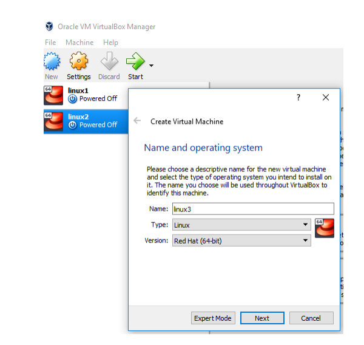

3. Selecione a Memória

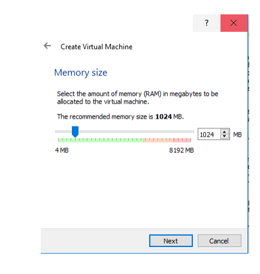

4. Selecione as seguintes opções:

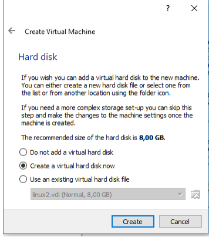

5. Na Virtual Box, selecione:

6. Escolha o Drive e disco ISO:

7. Instale CentOS 7:

8. Selecione:

9. Desativar o Kdump:

10. A partir do seguinte Painel:

11. Selecione Software Selection:

12. Selecione o Gnome com as seguintes opçõese clique concluído:

14. Faça as seguintes seleções:

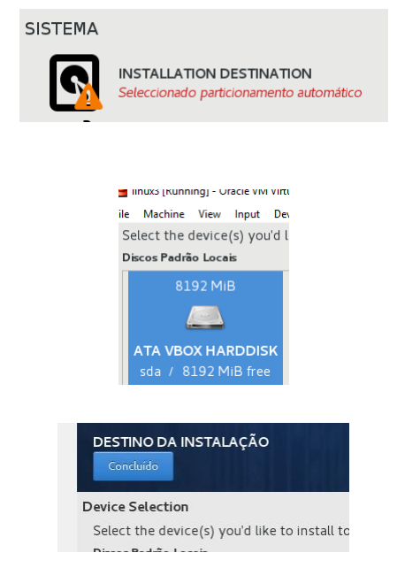

15. Pode ver o progresso da instalação em:

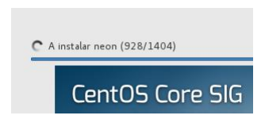

16. Crie a password para o utilizador ROOT:

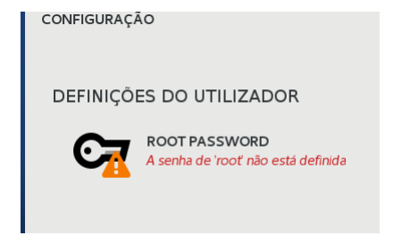

17. Crie a conta do utilizador:

18. Termine a configuração:

19. Faça o reboot da nova máquina:

20. Aceite a licença:

21. Explore o Sitema

