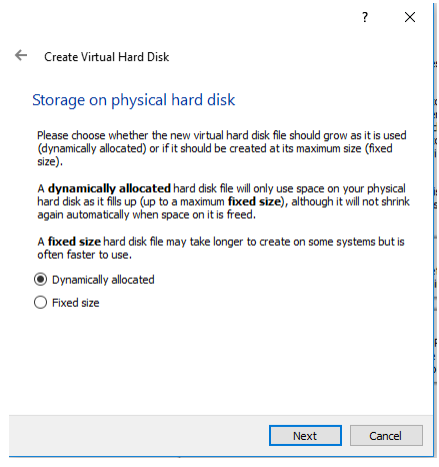

# Resumo de Sistemas Operativos

---

### Índice

- SO

- Processo

- IO

- Ficheiro

- Computador

- Linux

---

### SO

Conjunto de programas e dados associados, no qual permite gerir e utilizar recursos
disponíveis de um equipamento informático como um computador ou um smartphone. Alguns exemplos de Sistemas Operativos são: Windows, Mac OS e Solaris para computador e Android e iOS para smartphone.

Exemplo1: Windows 10

Exemplo2: Mac OS

---

#### Tipos de SO

- Monotarefa: sistema onde só é possível a realização de uma única tarefa de cada vez. Desta forma, uma tarefa é executada pelo processador desde o início até ao fim. Trata-se de uma técnica de gestão de tarefas ineficiente e limitada. Exemplo: o MS-DOS. Também um SO monotarefa ***não é preemptivo***, ou seja, não pode interromper a tarefa realizada.

- Multitarefa: sistema que tem a capacidade de executar vários processos em simultâneo. Trata-se de uma técnica de gestão de tarefas eficiente e moderna, conducente a uma boa otimização e desempenho geral do sistema. Exemplos: Solaris,bMicrosoft Windows, Unix/Linux e derivadose Apple/Macintosh. Também um SO multitarefa é ***preemptivo***, ou seja, pode interromper a tarefa realizada através de dar um tempo a outra tarefa para ser realizada, interrompendo a tarefa anterior.

---

#### Sistemas não Preemptivos e Preemptivos

Capacidade de um sistema, através do Kernel ou Processador poder interromper temporariamente uma tarefa que esteja a ser executada. A esta troca de processos dá-se o nome de Context Switch ou Troca de Contexto. Os Sistemas Preemptivos têm como objetivos:

-Executar comandos e programas do utilizador e do Sistema de uma forma
justa e eficiente, dando uma boa oportunidade a todos os processos,
respeitando prioridades;

-Facilitar o acesso e uso da máquina;

-Fornecer uma interface entre o Hardware e o utilizador;

-Utilizar o Hardware de forma eficiente: discos, placas, memórias,
ficheiros, etc.

-Gerir os recursos: Processos, ficheiros, memórias e entrada e saída de
dados(I/O)

---

#### Funções de um Sistema Operativo

1. Entrada/Saída de Dados (E/S) – Input/Output (I/O): ler ou escrever dados em sistemas de armazenamento externo (Discos Rígidos, CDs, etc.), impressão de dados e comunicação com os Periféricos e a CPU (Central Processing Unit);

2. Interpretação de Comandos (Shell): ler os comandos digitados pelos utilizadores, interpretá-los e executá-los apropriadamente. A Shell é um interface que pode tomar a forma de linha de comando ou gráfica (GUI – Graphics User Interface);

3. Gestão de Ficheiros: criação e Manipulação de Ficheiros, armazenamento dos ficheiros em estruturas lógicas e físicas, de rápido acesso e controlo do uso da memória secundária;

4. Segurança: proteção dos ficheiros, definindo modos de acesso, utilizadores e do próprio sistema (todas as suas estruturas);

5. Multitarefa (Controlo do uso do Processador e Tempo Compartilhado): vários utilizadores acedendo ao computador ao mesmo tempo, executando programas (processos) em tempo partilhado de processamento e controlo do uso do processador;

6. Gestão de Memória Física e Virtual: Gestão da Memória Física (RAM) e Virtual (área de SWAP no Disco), criação e gestão de Páginas Virtuais (pages) e Páginas Físicas (frames) e permutação de Processos entre as Memórias Física e Virtual;

7. Comunicação: com outros computadores, internamente ou por meios de telecomunicações, contabilidade e o registo dos recursos usados;

8. Desenvolvimento de Software: ferramentas para escrever, manter e executar programas (por exemplo, compiladores, bibliotecas, etc.);

9. Módulos de um Sistema Operativo:

- Gestão de Processos;

- Gestão da Memória Principal;

- Gestão de Ficheiros;

- Gestão de Input/output (I/O);

- Gestão da Memória Secundária;

- Gestão de Rede;

- Proteção e Segurança do Sistema;

- Interpretação de Comandos (Shell Linha de Comandos/Gráfica).

---

#### Componenstes de 1 SO:

1. O Kernel (núcleo): em conjunto com os drivers e o firmware do dispositivo, fornecem o nível mais básico de controle sobre todos os dispositivos de hardware do computador (CPU, Memória e Devices). Gere os acessos à memória RAM e determina quais os programas com maior prioridade e quais os recursos do hardware a que as aplicações acedem. Estabelece assim uma ligação entre as Aplicações e o Hardware;

2. Rede: é fundamental na maioria dos Sistemas Operativos pois permite-nos a ligação com outras máquinas, incluindo que estão na Internet. Assim, computadores com Sistemas Operativos diferentes, podem participar na mesma rede e partilhar recursos entre eles, como impressoras, scanners, etc; 

3. Segurança: deverá ter mecanismos para proteger a informação, para que os processos acedem as zonas de memória permitidas, etc;

4. Interface: pode ser gráfica (GUI) ou linha de comandos (terminal). Atualmente, quase todos os Sistemas Operativos contam com uma interface gráfica, mas ainda é possível encontrar o terminal em muitos locais. Depois do arranque do computador pela BIOS), parte do sistema sistema operativo é carregado para a memória RAM. Os programas de computador, funcionam dentro do Sistema Operativo e passam a chamar-se processos quando executados.

--- 

#### Software Livre

O código-fonte do Kernel Linux está disponível livremente sob a licença GPL (GNU General Public License – Licença Pública Geral) que permite que qualquer pessoa possa utilizar, modificar e distribuir livremente, desde que não altere os termos da licença.

---

#### Partição do Disco Rígido

A partição de um disco rígido é uma divisão dentro de uma unidade de armazenamento física com seu próprio Sistema de Ficheiros.  Ainda que se tenha apenas um disco rígido físico conectado, o sistema tratará cada partição como se fosse um disco rígido independente. Teremos assim um disco rígido físico e vários virtuais 

---

#### Sistemas de Ficheiros

A partição de um disco rígido tem divisões do seu próprio sistema de ficheiros, tendo um destes formatos: FAT, NTFS, FAT32, EXT2, etc. Existem 3 tipos de partições: 

1. Primárias (as originais, um disco rígido formatado é uma partição primária que ocupa todo o espaço);

2. Estendidas ou secundárias (uma partição que pode conter outras partições em seu interior);

3. Lógicas (as partições que ocupam uma parte ou a totalidade de uma estendida). 

---

#### Área de SWAP

Área do Disco rígido que serve de troca de processos ou tarefas. Trata-se de uma memória virtual que funciona como uma extensão da
memória RAM. A razão da existência da memória swap reside no fato do sistema operativo precisar de memória para funcionar, e se a memória acabar, o sistema falha. O swap fica como uma reserva de emergência caso a memória RAM acabe. É sempre recomendado utilizar swap, mesmo com muita memória RAM.

---

### Processos

Instância de um programa em execução. Funciona como um contentor ou ambiente onde existe um conjunto de recursos que são usados por parte do programa a ser executado dentro do ambiente. Este conjunto de recursos inclui tempo de CPU, memória, ficheiros e dispositivos de E/S, entre outros. Realce-se que o mesmo programa pode estar a ser executado por diferentes processos, por exemplo, múltiplos utilizadores. Para um SO é normal ter em execução centenas ou milhares de processos. Pode criar um ou mais subprocessos, para incumbências específicas, tal como estes também podem criar os seu próprios subprocessos, formando-se uma cadeia hierárquica de processos, numa relação de processos pais-filhos.

Um processo tem a seguinte constituição:

1. Código executável

2. Dados

3. Pilha de execução (Stack)

4. Heap ou GAP (espaço livre para ser usado sempre que necessário)

5. Valor do Contador de programa (PC – Program Counter)

---

#### Identificação de um Processo

Um processo pode ser identificado por diversos parâmetros, entre eles os seguintes:
1. Identificador: Um identificador único associado ao processo.

2. Estado: o estado atual do processo;

3. Prioridade: nível de prioridade relativamente a outros processos;

4. Programa Counter: o endereço da próxima instrução a ser executada no programa;

5. Ponteiros: da Memória Ponteiros para o código do programa e dados associados ao programa;

6. Dados de Contexto: dados presentes nos registos do CPU enquanto o processo está a ser executado.

---

#### Criação e Execução dos Processos

Um processo é criado pelo núcleo do Sistema Operativo, o Kernel, mais precisamente pelo Scheduler ou Escalonador de Processos, que é uma das funcionalidades do Kernel. Os processos são executados em pseudo-paralelismo. Cada processo é atribuída uma determinada fatia de tempo (quantum ou time slice) de execução de cada vez. Quando a fatia de tempo de um dado processo expira, o kernel muda o processamento para um outro processo com outra fatia de tempo, num mecanismo conhecido por comutação de processos, com base nas prioridades dos processos, interrupções, e de algoritmos de escalonamento a analisar brevemente.

Exemplo: A imagem abaixo ilustra o conceito de pseudo-paralelismo. O computador é partilhado por 4 processos: A, B, C, e D. O processo A é executado durante um time slice e logo que este intervalo de tempo expire é comutado, dando assim a vez ao processo B. Este mecanismo continua para os processos C e D, repetindo-se novamente todo o processo com a chamada de volta do processo A para mais um intervalo de tempo de execução e assim sucessivamente. Com o passar do tempo e a execução completa de todos os quatro processos, deu-se a ilusão de que os processos foram executados em paralelo.

---

#### Estados dos Processos

Durante o seu percurso de execução, um processo percorre vários estados:

1. Novo (New): está a ser criado, mas ainda não foi admitido no espaço dos processos prontos para execução. Isto significa que já foi criada uma estrutura (Process Control Block) para este processo, mas que ainda não foi carregado para a memória;

2. Pronto (Ready): está pronto a ser executado, aguardando atribuição de tempo de processamento de CPU;

3. Em Execução (Run): as instruções do processo estão a ser executadas;

4. Espera/Bloqueado (Waiting/Blocked): espera por eventos ou recursos, ficando assim bloqueado. Por exemplo, à espera da execução de uma tarefa que requereu um acesso I/O, tendo sido criado um processo filho para essa execução, pelo que está agora a aguardar por essa resposta (do processo filho);

5. Suspenso (Suspended): Time slice expirou. foi retirado do processador pelo Scheduler;

6. Concluído (Terminated): terminou e os seus recursos foram libertados.

---

#### Critérios de Processos

Há vários critérios para a análise de algoritmos de escalonamento:

1. Utilização da CPU: deve-se maximizar a utilização da CPU. Deve variar entre 40% e 90% em sistemas de tempo real. Um critério de maximização;

2. Débito (throughput): deve-se maximizar o número de processos concluídos por unidade de tempo. Outro critério de maximização;

3. Tempo de circulação (turnaround): tempo que decorre entre o instante em que um processo é submetido e o instante em que é concluído. Critério de minimização;

4. Tempo de espera: o tempo de espera é a soma dos períodos dispendidos na ready queue. Critério de minimização;

5. Tempo de resposta: pretende-se minimizar o tempo que decorre entre a submissão dum pedido e o início da resposta. Este critério é adequado para sistemas interativos. Critério de minimização.

---

#### Processo Table

Todos os processos encontram-se registados numa tabela que contém toda a informação acerca do estado de cada processo, como por exemplo:

1. Identificação do processo e do utilizador;
2. Prioridade;
3. Estado do processo;
4. Periféricos utilizados;
5. Ficheiros abertos;
6. Programas em execução;
7. Diretoria (pasta onde estava); 
8. Quotas de utilização de recursos;
9. Contabilização da utilização de recursos.

---

### IO (Input Output)

1. Gestão I/O: Uma das principais funções de um sistema operativo é controlo dos dispositivos I/O (em inglês: I/O=Input/Output ou em português: E/S = Entrada/Saída). Funções:

- Enviar comandos para o dispositivos;
- Detetar interrupções;
- Gestão de erros;
- Interface entre o utilizador e o resto do sistema.

2. Categorias de I/O:

- Block device: a informação é armazenada em blocos de tamanho fixo. Cada bloco contém um endereço. Os blocos vão normalmente de 128 a 1024 bytes, qualquer um pode ser lido independentemente em relação a qualquer outro. Exemplos: Discos, CDs, Pen, Fitas (bobinas), etc;

- Character: Transmite ou aceita streams (significa riachos). No contexto do Sistema I/O, significa fluxo de carateres (string). Exemplos: Terminais, Impressoras, Teclados e Ecrãs.

3. Device Controller (driver)

Os Controladores podem controlar 2, 4, 8 ou mais dispositivo idênticos. O sistema operativo normalmente lida com o controller e não com o dispositivo.

- É um adaptador com componente eletrónica + software;

- É uma unidade I/O sob a forma de: componente mecânica, eletrónica e SW;

- Temporização e Controlo das transmissões e interrupções;

- Comunicação com a CPU e com o dispositivo (periférico);

- Transferência dos dados;

- Deteção de erros.

4. Disk Controller: converte principalmente bits do disco, numa sequencia serial, em blocos e testa para erros. Se não houver erros, os blocos são copiados para a memória. Os controladores têm registos (buffers). O sistema operativo efetua operações I/O de comando através de
comandos para os registos de controlo dos devices. Exemplos no caso do disco:

- Read (ler);

- Write (escrever);

- Seek (procurar);

- Format (formatar);

- Entre outros.

5. DMA - Direct Memory Access 

Nos sistemas I/O e nos processos de transferências de data é muito usada a técnica de DMA (Direct Memory Access). É uma via direta entre um dispositivo I/O e a Memória. O controlador transfere diretamente e só no fim causa um interrupt. O CPU dá ao controlador duas coisas:

- Local da memória para onde transferir os dados; 

- O número de bytes a transferir.

6. Interrupt Handlers/Vectors e Interrupt Service Routines (ISRs) Handlers/Vectors (simulação de um exemplo tipo)

|Cod erro|Memória|Erro|
|:-:|:-:|:-:|
|000000|300000|Power Failure|
|000004|400000|Reset|
|000008|500000|Address Error|
|000012|600000|Bus Error|
|000016|700000|Illegal Address|
|000020|800000|Divide By Zero|
|000024|...|...|

7. Organização do Sistema I/O

O Sistema I/O é estruturado em quatro camadas:

- Interrupt Handlers
- Device Drivers
- Device – independente
- User level Software

---

#### Dispositivos I/O

1. Dispositivos de Entrada: codificam a informação que entram através de dados e possam assim ser processados para o computador. Exemplos: rato, teclado, scanner, joystick, etc;

2. Dispositivos de Saída: descodificam os dados em informação para que assim possam ser entendidos pelo usuário. Exemplos: Impressoras, monitores e projetores;

3. Dispositivos de entrada e saída: fazem as 2 coisas em simultâneo. Exemplos: Pen Drive, CD, Disquete.

---

### Ficheiro

Coleção de informação relacionada, identificada por um nome.

1. Propriedades dos Ficheiros:
- Nome;

- Tipo;

- Local;

- Tamanho;

- Datas (criação, última edição, etc.);

- Dono;

- Segurança (dono, grupo e outros ou mundo).

2. Operações sobre os Ficheiros:

- Criação;

- Escrita;

- Leitura;

- Eliminação;

- Cópias;

- Deslocação.

---

#### Sistema de Ficheiros

Estrutura de diretórios (pastas), bem organizada, que permite armazenar, criar e eliminar ficheiros em diferentes formatos. É constituído principalmente por duas partes bem visíveis:

1. Ficheiros (Dados);

2. Estrutura de Diretórios: é responsável pelas seguintes funcionalidades:

- Criação e eliminação de ficheiros e diretórios;

- Suporte das funções base para manipulação de ficheiros e diretórios;

- Mapeamento dos ficheiros (estrutura lógica) no suporte de armazenamento secundário (estrutura física);

- Criação de cópias de Segurança dos ficheiros em suporte estável, não volátil;

- Gestão e manutenção das permissões de acesso aos ficheiros.

---

#### Estrutura de Diretórios

Permite gerir e organizar o conjunto de ficheiros existentes num volume (disco). A organização mais comum e popular é em árvore com um número arbitrário de níveis. Estas são as operações desempenhadas num Diretório:

1. Pesquisa de Ficheiros;

2. Criação de Ficheiros;

3. Eliminação de Ficheiros;

4. Listagens de conteúdos;

5. Deslocação de ficheiros;

6. Organização dos Diretórios.

---

### Computador

É uma máquina que tem a capacidade de manipular a informação através das suas unidades de processamento, memória e periféricos de entrada
(input) e saída (output) de dados. Pode: 

- Armazenamento de dados;
- Processamento de dados; 
- Cálculo em grande escala;
- Desenho industrial e artístico; 
- Tratamento de imagens gráficas;
- Realidade virtual;
- Entretenimento e cultura;
- Aprendizagem Automática e de Processamento de Linguagem Natural (PLN);
- Entre outros.

As principais características de um Computador: 

1. Automático: manipula informação sem necessitar de intervenção humana;

2. Universal: manipula informação que representa áreas diferentes;

3. Eletrónico: usa componentes eletrónicas para manipular a informação; 

4. Digital: representa a informação através de dígitos binários.

---

#### Elementos Fundamentais de uma Arquitetura

- Convencional de Computadores: um computador moderno é constituído por um ou mais processadores com
um ou mais núcleos, Memória Principal (RAM, ROM, Caches, etc.), Secundária (Discos) e periféricos.

- Tipos de Componentes de um Computador: consiste por um conjunto de três tipos de componentes:

1. Processador;

2. Memória;

3. I/O (Input/Output).

- Categorias de Estruturas de Interconexão (BUS) de um Computador: estão interligados entre si através de
vias de interligação ou de interconexão, denominadas de barramentos ou
BUS (inglês). Elas comunicam entre si, sob controlo de sinais (Read, Write, etc.) e são agrupadas em três categorias:

1. Sinais de Controlo;

2. Endereços;

3. Dados.

---

#### Arquitetura de um computador

1. Motherboard: também conhecida como Placa-mãe, a Motherboard é a placa existente no seu interior que contém um conjunto de circuitos eletrónicos, responsáveis pelo processamento de dados e pelas trocas de informação no interior do computador. Os condutores impressos denominados barramentos, constituem circuitos elétricos, que transportam dados, endereços (localizações físicas de componentes e posições de memória) e sinais de controlo por todo o computador. Contém como componentes principais o microprocessador e as memórias RAM e ROM, para além de vários circuitos integrados e slots de expansão, interligados entre si, através das vias de interconexão.

---

2. CPU – Unidade Central de Processamento: constituída minimamente pelos seguintes componentes:

2.1 Unidade de Controlo (UC):

- Controla a execução das instruções do programa;

- Interpreta as diferentes instruções e ativa os subcomandos que as executam;

- Controla as transferências de dados (memória central/memória auxiliar e memória central/unidade aritmética e lógica).

2.2 Unidade Aritmética e Lógica (ALU – Arithmetic Logic Unit):

- Executa as operações aritméticas e lógicas através de registos (pequena área de memória, onde cabem 8 a 64 bits, utilizada em todas as operações efetuadas no interior
do microprocessador (CPU));

- Tratamento de Interrupções – CPU e Interrupt Controlar:  Uma das atividades principais da CPU, juntamente com o Controlador de interrupções, é o Controlo e Tratamento de Interrupções, a ser analisada brevemente.

---

3. Chipset: componente que se divide em 2 partes: a Ponte norte (north bridge) que comunica com o processador e controla a memória e a Ponte sul (south bridge) que comunica com os periféricos, entradas (por exemplo SATA) e as portas (exemplos: USB e HDMI).

---

4. Memórias: todos os dispositivos que permitem a um computador guardar dados, temporária ou permanentemente. Eis os 3 tipos de memória:

- RAM (Random Access Memory): memória de trabalho onde são armazenados os programas e os dados que intervêm no processamento do computador. A sua capacidade de armazenamento determina a extensão dos dados e programas que podem residir na memória durante a execução dos programas. Eis os 2 tipos:

1. SRAM (Static RAM): Pequena, cara, rápida e de fabrico à base de transístores. Aplica técnicas que tornam os acessos aos dados de uma forma
mais rápida, aumentando assim o desempenho do computador. Eis os exemplos: 

- SDR (Single Data Rate SDRAM);

- DDR (Double Data Rate);

2. DRAM (Dynamic RAM): Vasta, barata, lenta e de fabrico normalmente à base de condensadores. Um exemplo é SDRAM (Synchronous Dynamic), que sincroniza com o Barramento do Sistema. Permite assim uma operação (leitura, escrita) regulada e justa.

---

- ROM (Read Only Memory): memória permanente do computador onde estão inscritas as rotinas básicas de software necessárias ao arranque do computador e ao teste dos vários dispositivos do hardware. Um dos componentes mais importantes da ROM é a BIOS, conjunto de programas que viabilizam a ligação do software com o hardware. Eis os tipos de ROM:

1. PROM (Programmable Read Only Memory): podem ser gravadas através de dispositivos especiais, mas não podem ser mais apagadas ou alteradas;

2. EPROM (Erasable Programmable Read Only Memory): podem ser apagadas através de raios ultravioleta permitindo assim a sua reutilização;

3. EEPROM (Electrically Erasable Programmable Read Only Memory): podem alterar o seu conteúdo eletricamente, mesmo quando após o seu funcionamento;

4. Flash: memória de Leitura e Escrita. Combina assim as capacidades da ROM e da RAM. É cara mas veloz e é usada em: Pen Drives, MP3 Players Audio, PDAs – Personal Digital Assistant (computadores pequenos tipo agendas), Telemóveis, etc.

---

- CACHE: memória muito rápida que desempenha o papel de intermediária entre a memória RAM e o processador. Nesta memória, são armazenadas as instruções utilizadas com mais frequência. Pode aumentar significativamente o desempenho global do sistema. Existem 3 tipos de cache:

1. Cache L1: pequena porção de memória estática presente dentro do processador. Em alguns tipos de processador, como o Pentium
2, é dividido em dois níveis: dados e instruções. Geralmente tem entre 16KB e 128KB mas atualmente já têm 16MB de cache;

2. Cache L2: possuindo a Cache L1 um tamanho reduzido e não apresentando uma solução ideal, foi desenvolvida a cache L2, que contém muito mais memória que a cache L1. Ela é mais um caminho para que a informação requisitada não tenha que ser procurada na lenta memória principal. Alguns processadores colocam esse cache fora do processador, por questões económicas, pois uma cache grande implica num custo grande, mas há exceções, como no Pentium II, por exemplo, cujas caches L1 e L2 estão no mesmo cartucho, que está o processador. A memória cache L2 é, sobretudo, um dos elementos essenciais para um bom rendimento do processador mesmo que tenha um clock baixo;

3. Cache L3: 3º nível de cache de memória. Utiliza o cache externo presente na placa-mãe como uma memória de cache adicional, apesar de ser um tipo de cache raro devido a complexidade dos processadores atuais, com suas áreas chegando a milhões de transístores por micrómetros ou nanómetros de área. Ela será muito útil, sendo possível a necessidade futura de níveis ainda mais elevados de cache, como L4 e assim por diante.

---

5. Controladores I/O (Input/Output – Entrada/Saída): interface que é tanto parte hardware como software, entre a CPU e um dispositivo periférico. Exemplos: disco rígido teclado ou monitor de vídeo. São assim programas e circuitos de hardware (drivers) responsáveis pela comunicação entre o sistema operativo do computador e o hardware ligado a ele. Além disto, combinam as velocidades entre os dispositivos que operam em velocidades diferentes, já que os periféricos são consideravelmente mais lentos do que a CPU na transferência de dados;

---

6. Registos e Circuitos de Apoio: entre os diversos componentes do computador, existem registos, que funcionam como memórias auxiliares e circuitos eletrónicos necessários à boa condução dos dados, endereços e sinais;

---

7. Estruturas de Interconexão – Barramentos - BUSes: vias de interligação entre os componentes. Agrupam-se principalmente em três categorias:

1. Dados (Barramento de Dados – Data Bus) É a via destinada à transmissão dos dados entre os componentes do computador, tanto enviados quanto recebidos;

2. Endereços (Barramento de Endereços – Address Bus) Designa o endereço físico de um componente ou uma posição de memória;

3. Controle (Barramento de Controle – Control Bus) Constituem os sinais de controle que regulam e controlam todas as atividades do computador. Por exemplo, o sinal Read para indicar uma leitura de um determinado dado de memória.

---

### Linux

Foi criado em 17 de setembro de 1991 e foi inspirado no sistema operacional Unix. Consiste num Sistema Operativo mais seguro de modo a salvaguardar os dados mais importantes. De todos os Sistemas Operativos, este é o mais seguro, mas implica saber como configurar a segurança de dados através do código Shell.

---

#### Distribuições Linux

Existem muitas distribuições Linux. Cada uma delas tem finalidades
específicas. A maioria é gratuita, mas também existem as pagas
(normalmente usadas em empresas). No decorrer do tempo, várias
distribuições surgiram e desapareceram. As mais populares são as
distribuições de companhias como a **Red Hat** (também criadora do Fedora),
a **SuSE**, a **Mandriva** (união da Mandrake com a Conectiva) e a **Canonical**
(Ubuntu), além de projetos de comunidades como o **Debian** ou o **Gentoo**.

---

#### Linux versus Windows 10

Alguns aspetos que distinguem o Linux do Windows:

1. Windows 10 é mais lento no hardware mais antigo;

2. O tamanho do download do Windows 10 é muito maior do que o do Linux;

3. É grátis (tanto o setup como as atualizações) ao contrário do Winows (paga-se o setup e atualizações);

4. Tem muito mais aplicativos gratuitos;

5. É mais seguro que o Windows, visto que basta manter os repositórios e evitaro uso do Flash da Adobe;

6. O Windows não é tão confiável quanto o Linux, devido aos programas do Windows pendurarem-se com muito mais facilidade.

---

#### Processo Prático de Instalação

1. Instalação do CentOS-7-x86_64-DVD-1708, versão Linux da Red-Hat.
Primeiramente, fazer o download de um DVD ISO e gravá-lo numa pasta do
disco, por exemplo em D:\LINUX ISO:
A partir da Oracle VM VirtualBox Manager, crie uma nova máquina Linux:

2. Click em New

3. Selecione a Memória

4. Selecione as seguintes opções:

5. Na Virtual Box, selecione:

6. Escolha o Drive e disco ISO:

7. Instale CentOS 7:

8. Selecione:

9. Desativar o Kdump:

10. A partir do seguinte Painel:

11. Selecione Software Selection:

12. Selecione o Gnome com as seguintes opçõese clique concluído:

14. Faça as seguintes seleções:

15. Pode ver o progresso da instalação em:

16. Crie a password para o utilizador ROOT:

17. Crie a conta do utilizador:

18. Termine a configuração:

19. Faça o reboot da nova máquina:

20. Aceite a licença:

21. Explore o Sitema

---

#### Comandos básicos linux

|Nome|Função|Exemplo|
|:-:|:-:|:-:|
|cat|cria um ficheiro no terminal|cat f1|
|cd|Mover entre diretórios|cd .. (vai para o diretório anterior)|
|chmod|Altera permissões de uma pasta/ficheiro.|chmod 751 (neste exemplo,o dono pode fazer tudo, o grupo pode ler e executar e o mundo apenas pode executar) f1ch1|
|cp|Copia ficheiros|cp f1 f2|
|cron|Cria uma tarefa |cron 10 15 8 3 15 echo "olá" /dev/pts/0|
|find|Procura o nome de qualquer coisa|find pasta|
|ls|Mostra tudo o que está dentro da pasta onde está seja ficheiro como pastas|ls -l (mostra tudo em formato lista)|
|man|Mostra como funciona o comando|man vi|
|mkdir|cria diretório|mkdir pasta|
|mv|move o ficheiro para outra pasta ou modifica o nome|mv f1 pasta/mv f1 file1|
|rm|apaga ficheiro|rm f1|
|rmdir|apaga diretório (tem de estar vazio)|rmdir pasta|
|tar|cria um backup|tar -cvf f1.tar pasta (cria o backup)/tar -xvf f1.tar pasta (extrai o backup)|
|vi|criaum ficheiro de tipo texto no bloco de notas|vi f1|

---

##### Comandos no VI

|Nome|Função|
|:-:|:-:|
|Botão "esc"|Alterna entre modo comando e modo texto|
|Botão "insert"|Muda para modo texto|
|:q|Sai mas pede para guardar|
|:wq|Sai e guarda|
|a|Insere à direita|
|A|Insere à direita, no fim da linha|
|d|Corta texto selecionado|
|i|Insere à esquerda|
|I|Insere à esquerda, no início da linha|
|o|Insere linha abaixo|
|O|Insere linha acima|
|p|Cola texto|
|Setas de direção do teclado|move o cursor|
|y|Copia texto|

---

##### Permissões Chmod

|Permissão|Modo|Binário|Octal|Conta|
|:-:|:-:|:-:|:-:|:-:|
|Nenhum|- - -|0|0|0|
|Execução|- - x|1|1|1|
|Escrita|- w -|10|2|2|
|Escrita e execução|-wx|11|3|1+2|
|Leitura|r - -|100|4|4|
|Leitura e execução|r-x|101|5|1+4|
|Leitura e escrita|rw-|110|6|2+4|
|Leitura, escrita e execução|rwx|111|7|1+2+4|

|Ordem de permissão|Usuário|
|:-:|:-:|
|1|Dono|
|2|Grupo|
|3|Mundo|

---

##### Propriedades cron

|Ordem|Nome|Formato|
|:-:|:-:|:-:|
|1|Minuto|0-59|
|2|Hora|0-23|
|3|Mês|1-12 ou jan,fev,mar,apr,may,jun,jul,aug,sep,oct,nov,dec|
|4|Dia da semana|0-6 ou sun,mon,tue,wed,thu,fri,sat|
|5|Dia do Mês|1-31 ou aceita alcance ex: 1-5|
|6|Comando|Exemplo: cp f1 f2|
|Especial|Pode assumir qualquer valor|*|

|SubComando|Função|
|:-:|:-:|
|crontab -e|cria nova tarefa|
|crontab -l|lista de tarefas|
|crontab -r|remove tarefa|

---

##### Diretórios

|Nome|Função|
|:-:|:-:|
|/bin|Comandos utilizados durante o boot e por utilizadores comuns.|
|/boot|Ficheiros utilizados durante a inicialização do sistema e o Kernel.|
|/dev|Dispositivos (modem, mouse, teclado, etc..).|
|/etc|Ficheiros de configurações do sistema.|
|/home|Diretório HOME dos utilizadores comuns.|
|/proc|Sistema de ficheiros virtual (na memória) com dados do Kernel.|
|/root|Diretório HOME do Superuser (Super Utilizador).|
|/usr|Contém ficheiros de todos os programas e bibliotecas para o uso dos utilizadores do Linux.|
|/var|Contém ficheiros que são modificados com o decorrer do uso do sistema (e-mail , temporários, filas de impressão, manuais).|

---

##### Processos

|Nome|Processo|
|:-:|:-:|
|0|Boot|
|1|Processo na memória|
|2|Processo do Sistema|
|10|Processo Pemutado|
|ADDR|Address da Memória|
|B|Waiting|
|f|	lista completa acerca dos processos|
|Getty|Process daemon login|
|Init|Process daemon (arranque Sistema Boot)|
|pid|process identification|
|ppid|Process Parent Identification|
|R|Running|
|S|Sleeping|
|sched|escala os processos|
|sort|ordenar dados|
|Swapper|Troca de Processos|
|SZ|Tamanho do Bloco|
|T|Stopped|
|TIME|quantidade de tempo do CPU o processo usou. Caso aparecer 0,0 tava a ser usado|
|tty|num de terminal|
|?||sistema|
